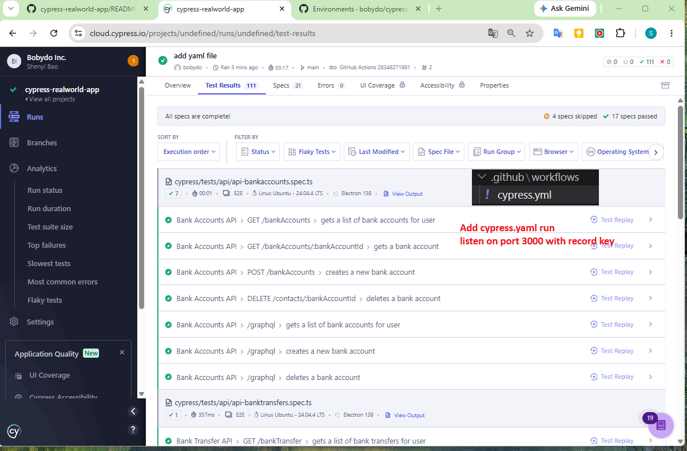

# Cypress Improvements Over Time

## Save test results to cloud
npx cypress run --component --record --key <key>


## Changed package.json and kill existing process in case you close terminal accidental
"predev": "npx kill-port 3000 3001 3002 3003 && yarn db:seed:dev",

## Cross-origin testing: `cy.origin()`

**The old limitation:** pre-v12 Cypress could only test **one superdomain per test**.
Cypress ran its driver code inside the *same browser tab/JS context* as the app under
test. If the app redirected to a different origin (e.g. Auth0's hosted login page,
Okta, Stripe checkout), the browser tore down that whole context — taking Cypress's
injected control code down with it. There was no workaround inside a real test; people
faked login with `cy.request()` instead of clicking through the real UI.

**The fix:** `cy.origin()` — introduced as an experimental flag (`experimentalSessionAndOrigin`)
around **Cypress 9.6**, made **stable/default in Cypress 12** (no flag needed since then).
It works by spinning up an isolated execution context for the foreign origin and proxying
commands into it.

This repo (on Cypress 15.17.0) uses it for real, in
[cypress/support/auth-provider-commands/auth0.ts:23](cypress/support/auth-provider-commands/auth0.ts#L23):

```ts
Cypress.Commands.add("loginToAuth0", (username: string, password: string) => {
  const args = { username, password };

  // App landing page redirects to Auth0.
  cy.visit("/");

  // Login on Auth0 — a different domain than the app's baseUrl,
  // only possible because of cy.origin().
  cy.origin(Cypress.expose("auth0_domain"), { args }, ({ username, password }) => {
    cy.get("input#username").type(username);
    cy.get("input#password").type(password, { log: false });
    cy.get('button[type="submit"]').click();
  });

  // Ensure Auth0 has redirected us back to the RWA (back on baseUrl).
  cy.url().should("equal", Cypress.config().baseUrl + "/");
});
```

Before `cy.origin()` existed, the equivalent test would have had to skip the real Auth0
UI entirely and fake the session, e.g.:

```ts
// pre-v12 workaround — no real UI interaction with the foreign domain
cy.request("POST", "https://your-tenant.auth0.com/oauth/token", {
  grant_type: "password",
  username,
  password,
  client_id: Cypress.expose("auth0_client_id"),
}).then(({ body }) => {
  window.localStorage.setItem("auth0_token", body.access_token);
});
```

**Soundbite for interviews:** "Cross-origin support was Cypress's biggest historical gap
versus Selenium/Playwright. `cy.origin()` closed that gap by isolating each origin's
command execution rather than trying to share one JS context across domains."

| | Pre-v9.6 | v9.6 – v11 | v12+ |
|---|---|---|---|
| Cross-origin in one test | Not possible | Possible behind `experimentalSessionAndOrigin` flag | Stable, on by default |
