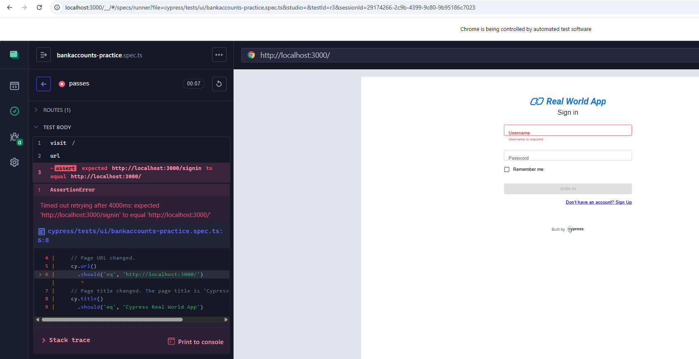

# Cypress Studio Recording — Setup, Selectors, Actions, Verifications

## Root folder config (this repo)

From [cypress.config.ts](cypress.config.ts):

```ts
e2e: {
  baseUrl: "http://localhost:3000",
  specPattern: "cypress/tests/**/*.spec.{js,jsx,ts,tsx}",
  supportFile: "cypress/support/e2e.ts",
}
component: {
  specPattern: "src/**/*.cy.{js,jsx,ts,tsx}",
}
```

- E2E specs **must** live under `cypress/tests/**/` and end in `.spec.ts` — the Cypress
- `baseUrl` lets you write `cy.visit('/')` instead of the full `http://localhost:3000/`.
- The dev server (`yarn dev` / `npm start`) must already be running on port 3000 before
  you record — Studio just drives a normal browser tab, it doesn't boot the app for you.

## How to record (recap)

1. `yarn cypress open` → E2E Testing → pick a browser → spec list.
2. Open an existing spec, or **New Spec** with a path like
   `cypress/tests/ui/bankaccounts-practice.spec.ts`.
3. The top "URL" bar and the `TEST BODY` command list in the Cypress App are **read-only
   displays** — you cannot type into them. To change what URL a test starts on, edit
   `cy.visit(...)` in the spec file itself, in your editor.
4. Hover a passed test in the Command Log → click the **Edit in Studio** arrow → interact
   with the app normally (click, type, check boxes). Each action is recorded as a command
   in real time.
5. Right-click an element to add an assertion against its current state.
6. Save — Studio writes the generated commands into the spec file on disk.
7. Sample code at bankaccounts-practice.spec.ts

## Other benefits of using Studio recording (beyond "learn selectors/actions/verifications")

1. **Fast first draft / scaffolding.** Get a working skeleton in seconds, then prune and
   rename rather than typing every `cy.get()` from scratch.
2. **Bug repro capture.** When you hit a flaky or broken flow manually, recording the
   exact repro steps is faster and more precise than writing a prose bug report — attach
   the generated spec to the ticket.
3. **Onboarding tool.** New team members unfamiliar with the app's DOM/selectors can
   record a flow to see real selectors and assertion patterns instead of reverse
   engineering them from scratch.
4. **Selector-convention audit.** Comparing what Studio picked vs. what your team's
   convention requires (like the `name` vs `data-test` mismatch above) is itself a useful
   review step — it surfaces inputs/elements that are missing proper `data-test`
   attributes in the app code, which is worth fixing at the source.
5. **Assertion API discovery.** Right-click → assertion menu surfaces Chai/jQuery
   assertions you may not remember exist, useful as a reference while learning.
6. **Interview talking point.** Having hands-on experience with Studio (its strengths
   *and* its rough edges — selector quality, recording artifacts) lets you give a
   grounded comparison against Playwright codegen instead of a memorized table — see the
   corrected comparison and Studio rollout history (`removed → reinstated 10.7.0 


